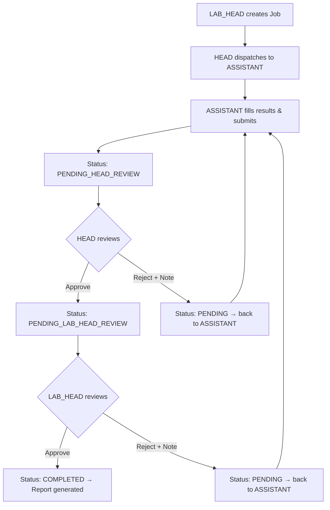

# Two-Level Review Chain: HEAD + LAB_HEAD Approval

## Flow



## Status Lifecycle

| Status | Meaning |
|--------|---------|
| `PENDING` | Assigned to ASSISTANT, awaiting their input |
| `PENDING_HEAD_REVIEW` | ASSISTANT submitted, HEAD must review |
| `PENDING_LAB_HEAD_REVIEW` | HEAD approved, LAB_HEAD must review |
| `COMPLETED` | LAB_HEAD approved, report generated |

## Design Decisions

### On Reassignment (by HEAD or LAB_HEAD)
- The ASSISTANT sees their **previous values as reference text** (read-only, shown below or beside each parameter)
- The **input boxes are empty** — they must re-enter values
- A **review note banner** appears at the top explaining what went wrong

### Review Notes
- Both HEAD and LAB_HEAD can attach a note when rejecting
- Notes are stored in a `reviewHistory` array so the full back-and-forth is preserved
- The ASSISTANT sees the **latest** rejection note prominently

---

## Proposed Changes

### Backend

#### [MODIFY] [TestInstance.js](file:///home/archani/Projects/AIPER/backend/models/TestInstance.js)

Update the schema:

```js
status: {
  type: String,
  enum: ['PENDING', 'PENDING_HEAD_REVIEW', 'PENDING_LAB_HEAD_REVIEW', 'COMPLETED'],
  default: 'PENDING'
}
```

Add new fields:
```js
previousResults: [resultParameterSchema],  // snapshot of last submission (for reference display)
reviewHistory: [{
  action: { type: String, enum: ['APPROVE', 'REASSIGN'] },
  by: { type: mongoose.Schema.Types.ObjectId, ref: 'User' },
  role: String,          // 'HEAD' or 'LAB_HEAD'
  note: String,          // rejection reason
  date: { type: Date, default: Date.now }
}]
```

---

#### [MODIFY] [testRoutes.js](file:///home/archani/Projects/AIPER/backend/routes/testRoutes.js)

**1. Change ASSISTANT submission** (`PUT /instances/:id/results`):
- Set status → `PENDING_HEAD_REVIEW` (instead of `COMPLETED`)
- Do NOT update Job distribution status
- Do NOT set `completedAt`

**2. Add HEAD review route** — `PUT /instances/:id/review` (HEAD only):
- `{ action: 'APPROVE' }` → set status to `PENDING_LAB_HEAD_REVIEW`, log to `reviewHistory`
- `{ action: 'REASSIGN', note: '...' }` → snapshot current `results` into `previousResults`, clear `results` values, set status back to `PENDING`, log to `reviewHistory`

**3. Add LAB_HEAD review route** — `PUT /instances/:id/lab-review` (LAB_HEAD only):
- `{ action: 'APPROVE' }` → set status to `COMPLETED`, set `completedAt`, update Job distribution status, log to `reviewHistory`
- `{ action: 'REASSIGN', note: '...' }` → same as HEAD reassign: snapshot results, clear values, status → `PENDING`, log to `reviewHistory`

**4. Update GET /instances query logic:**
- HEAD: also see instances with `status: 'PENDING_HEAD_REVIEW'` that they created
- LAB_HEAD: see instances with `status: 'PENDING_LAB_HEAD_REVIEW'` (all, since they oversee everything)
- ASSISTANT: see `status: 'PENDING'` instances (unchanged — reassigned ones reappear here automatically)

---

### Frontend

#### [MODIFY] [HeadDashboard.jsx](file:///home/archani/Projects/AIPER/frontend/src/pages/HeadDashboard.jsx)

**Add "Review Queue" page** (`/head/review`):
- Fetch instances with `status: PENDING_HEAD_REVIEW` created by this HEAD
- For each instance, display:
  - Test code, blueprint name, analyst name
  - Submitted results table (read-only) with parameter name, value, unit, reference range
  - Review history (if any previous rejections)
- Action buttons:
  - **✅ Approve & Forward to Lab Head**
  - **🔄 Reassign to Analyst** — opens a text area for the rejection note

**Add route:**
- `<Route path="/review" element={<ReviewQueue />} />`

**Update Dashboard stats:**
- Add or update a stat card for "Awaiting Your Review" count

**Update nav sidebar** (in App.jsx):
- Add "Review" link for HEAD

---

#### [MODIFY] [LabHeadDashboard.jsx](file:///home/archani/Projects/AIPER/frontend/src/pages/LabHeadDashboard.jsx)

**Add "Review Queue" page** (`/lab-head/review`):
- Fetch instances with `status: PENDING_LAB_HEAD_REVIEW`
- Same layout as HEAD review but with different actions:
  - **✅ Approve & Generate Report** — finalizes the job
  - **🔄 Reassign to Analyst** — rejection note, sends back to PENDING

**Add route:**
- `<Route path="/review" element={<LabReviewQueue />} />`

**Update Dashboard stats:**
- Add "Awaiting Your Review" card

**Update nav sidebar:**
- Add "Review" link for LAB_HEAD

---

#### [MODIFY] [AssistantDashboard.jsx](file:///home/archani/Projects/AIPER/frontend/src/pages/AssistantDashboard.jsx)

- When opening a reassigned task (has `previousResults` and `reviewHistory`):
  - Show a **rejection note banner** at the top (latest note from `reviewHistory`)
  - For each parameter row, show the **previous value as grey reference text** below or beside the empty input
- `openTask` logic: always initialize input values as `''` (empty), regardless of previous submission
- Task cards in the queue: show a "Reassigned" badge if the task has review history

---

#### [MODIFY] [JobTimeline.jsx](file:///home/archani/Projects/AIPER/frontend/src/components/JobTimeline.jsx)
- Add handling for `PENDING_HEAD_REVIEW` and `PENDING_LAB_HEAD_REVIEW` statuses
- New badge colors: blue/info for review stages

---

#### [MODIFY] [App.jsx](file:///home/archani/Projects/AIPER/frontend/src/App.jsx)
- Add "Review" nav links for HEAD and LAB_HEAD in the sidebar

---

## Verification Plan

### Test Scenarios
1. **Happy path**: ASSISTANT submits → HEAD approves → LAB_HEAD approves → status = COMPLETED, report accessible
2. **HEAD rejects**: ASSISTANT submits → HEAD reassigns with note → ASSISTANT sees task back in queue with note + previous values as reference → re-submits → HEAD approves → LAB_HEAD approves
3. **LAB_HEAD rejects**: Full chain passes HEAD → LAB_HEAD reassigns → ASSISTANT sees it again with LAB_HEAD's note → cycle repeats
4. **Multiple rejections**: Verify `reviewHistory` accumulates entries correctly
5. **Job distribution status**: Only updates to `COMPLETED` after LAB_HEAD approval (not before)
6. **Audit/Reports**: Only `COMPLETED` instances appear in audit tables and PDF views
